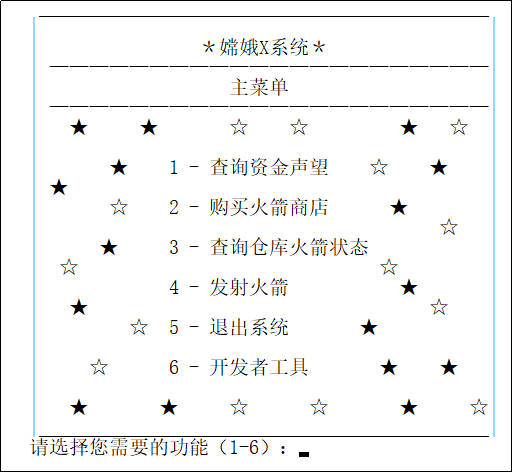
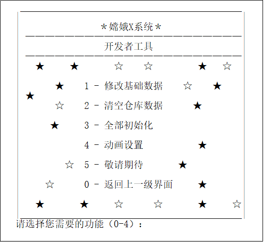
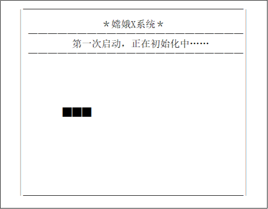

<h1 align="center"></h1>

  
  
  

<h1 align="center">
  私人火箭运营模拟系统
</h1>

  纯C语言课程设计

  
  

  
   
  本项目使用AGPL-3.0开源协议

## 🧭 项目简介
大一跟着学校学完C语言以后，老师要求用纯C语言写一个课程设计，我自己设计了一个课题——“私人火箭运营模拟系统”，虽然现在看起来很简单，但是效果我还是很满意的。
## 🍔 食用方法
src文件夹内存放所有的源文件，首次使用请在`menu.c`文件下编译文件，数据文件会自动生成。

课程设计文档与测试数据文档均在目录下，**已抹去敏感信息**。

希望大家可以通过我写的这个课程设计有更多的灵感，学习是自己的事情，只有自己认认真真做了一遍，才能真正学会知识。
## 🧧 赞助
如果喜欢的话，请作者喝杯咖啡吧！（赞助一点点也行喔！非常感谢QWQ）

  

## 🤙 联系我
📥 Email: 931911761@qq.com

